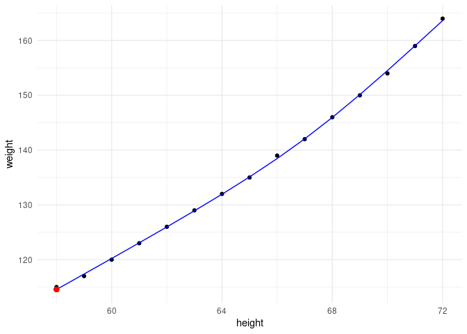
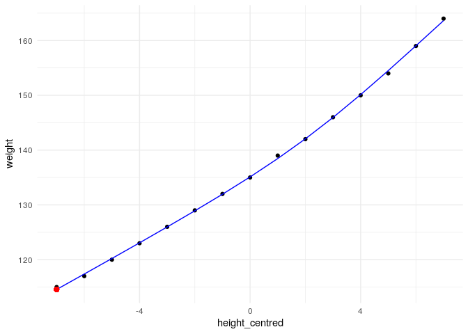
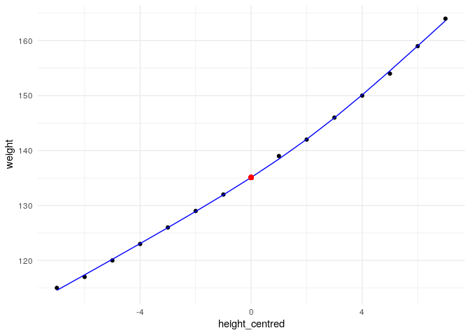
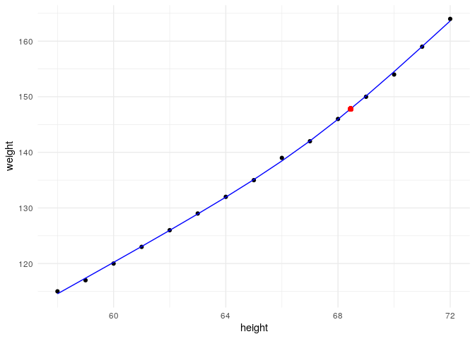

<!-- README.md is generated from README.Rmd. Please edit that file -->

# splintr

[](https://github.com/simisc/splintr/actions)
[](https://zenodo.org/badge/latestdoi/141533742)
[](https://github.com/simisc/splintr/blob/master/LICENSE)
[](https://www.tidyverse.org/lifecycle/#stable)

Natural cubic splines with interpretable intercepts: ‘centres’ a basis
generated using `splines::ns()` on a specified x-value. When used in a
model formula, this allows the model intercept to be interpreted with
respect to that central x-value, rather than with respect to the x-value
of the first `splines::ns()` knot.

## Installation

You can install splintr from github with:

``` r
# install.packages("devtools")
devtools::install_github("simisc/splintr")
```

## Example

``` r
library(broom)   # tidy(), augment()
library(knitr)   # kable()
library(splines) # ns()
library(splintr) # splintr()
library(ggplot2) # ggplot()
library(dplyr)   # %>%
theme_set(theme_minimal())
```

``` r
women <- women %>%
  mutate(height_centred = height - mean(height))
women %>%
  head() %>%
  kable()
```

| height | weight | height\_centred |
| -----: | -----: | --------------: |
|     58 |    115 |             \-7 |
|     59 |    117 |             \-6 |
|     60 |    120 |             \-5 |
|     61 |    123 |             \-4 |
|     62 |    126 |             \-3 |
|     63 |    129 |             \-2 |

Using `splines::ns()` in a model formula as below, the model intercept
represents the estimated value of `weight` at the first boundary knot,
i.e. when `height` takes its minimum value of 58.

``` r
fit0 <- lm(weight ~ ns(height, df = 3), data = women)
fit0 %>%
  tidy(quick = TRUE) %>%
  kable()
```

| term                |  estimate | std.error | statistic | p.value |
| :------------------ | --------: | --------: | --------: | ------: |
| (Intercept)         | 114.55946 | 0.2455372 | 466.56662 |       0 |
| ns(height, df = 3)1 |  23.87318 | 0.3439476 |  69.40935 |       0 |
| ns(height, df = 3)2 |  53.04162 | 0.6170320 |  85.96251 |       0 |
| ns(height, df = 3)3 |  41.66370 | 0.2618841 | 159.09215 |       0 |

``` r
(knots <- ns(women$height, df = 3) %>%
  attr("Boundary.knots"))
#> [1] 58 72
predict(fit0, newdata = data.frame(height = 0))
#>         1 
#> -49.06522
predict(fit0, newdata = data.frame(height = knots[1]))
#>        1 
#> 114.5595
augment(fit0, data = women) %>%
  ggplot(aes(x = height)) +
  geom_point(aes(y = weight)) +
  geom_line(aes(y = .fitted), col = "blue") +
  geom_point(data = NULL, aes(x = knots[1], y = coef(fit0)[1]), col = "red", size = 2)
```



Centring the predictor does not change the model intercept.

``` r
fit1 <- lm(weight ~ ns(height_centred, df = 3), data = women)
fit1 %>%
  tidy(quick = TRUE) %>%
  kable()
```

| term                         |  estimate | std.error | statistic | p.value |
| :--------------------------- | --------: | --------: | --------: | ------: |
| (Intercept)                  | 114.55946 | 0.2455372 | 466.56662 |       0 |
| ns(height\_centred, df = 3)1 |  23.87318 | 0.3439476 |  69.40935 |       0 |
| ns(height\_centred, df = 3)2 |  53.04162 | 0.6170320 |  85.96251 |       0 |
| ns(height\_centred, df = 3)3 |  41.66370 | 0.2618841 | 159.09215 |       0 |

``` r
(knots <- ns(women$height_centred, df = 3) %>%
  attr("Boundary.knots"))
#> [1] -7  7
predict(fit1, newdata = data.frame(height_centred = 0))
#>        1 
#> 135.1067
predict(fit1, newdata = data.frame(height_centred = knots[1]))
#>        1 
#> 114.5595
augment(fit1, data = women) %>%
  ggplot(aes(x = height_centred)) +
  geom_point(aes(y = weight)) +
  geom_line(aes(y = .fitted), col = "blue") +
  geom_point(data = NULL, aes(x = knots[1], y = coef(fit1)[1]), col = "red", size = 2)
```



Using `splintr()` instead, the intercept representes the estimated value
of `weight` when the predictor `height_centred` takes a value of zero.

``` r
fit2 <- lm(weight ~ splintr(height_centred, df = 3), data = women)
fit2 %>%
  tidy(quick = TRUE) %>%
  kable()
```

| term                              |  estimate | std.error |  statistic | p.value |
| :-------------------------------- | --------: | --------: | ---------: | ------: |
| (Intercept)                       | 135.10672 | 0.1288238 | 1048.77107 |       0 |
| splintr(height\_centred, df = 3)1 |  23.87318 | 0.3439476 |   69.40935 |       0 |
| splintr(height\_centred, df = 3)2 |  53.04162 | 0.6170320 |   85.96251 |       0 |
| splintr(height\_centred, df = 3)3 |  41.66370 | 0.2618841 |  159.09215 |       0 |

``` r
(knots <- splintr(women$height_centred, df = 3) %>%
  attr("Boundary.knots"))
#> [1] -7  7
predict(fit2, newdata = data.frame(height_centred = 0))
#>        1 
#> 135.1067
augment(fit2, data = women) %>%
  ggplot(aes(x = height_centred)) +
  geom_point(aes(y = weight)) +
  geom_line(aes(y = .fitted), col = "blue") +
  geom_point(data = NULL, aes(x = 0, y = coef(fit2)[1]), col = "red", size = 2)
```



Alternatively, an arbitrary “centre” can be specified directly in the
`splintr()` call.

``` r
x_centre = 68.45
fit3 <- lm(weight ~ splintr(height, df = 3, centre = x_centre), data = women)
fit3 %>%
  tidy(quick = TRUE) %>%
  kable()
```

| term                                         |  estimate | std.error | statistic | p.value |
| :------------------------------------------- | --------: | --------: | --------: | ------: |
| (Intercept)                                  | 147.80566 | 0.1513002 | 976.90337 |       0 |
| splintr(height, df = 3, centre = x\_centre)1 |  23.87318 | 0.3439476 |  69.40935 |       0 |
| splintr(height, df = 3, centre = x\_centre)2 |  53.04162 | 0.6170320 |  85.96251 |       0 |
| splintr(height, df = 3, centre = x\_centre)3 |  41.66370 | 0.2618841 | 159.09215 |       0 |

``` r
(knots <- splintr(women$height, df = 3, centre = x_centre) %>%
  attr("Boundary.knots"))
#> [1] 58 72
predict(fit3, newdata = data.frame(height = x_centre))
#>        1 
#> 147.8057
augment(fit3, data = women) %>%
  ggplot(aes(x = height)) +
  geom_point(aes(y = weight)) +
  geom_line(aes(y = .fitted), col = "blue") +
  geom_point(data = NULL, aes(x = x_centre, y = coef(fit3)[1]), col = "red", size = 2)
```



The four models fit identically:

``` r
rbind(fit0 = glance(fit0),
      fit1 = glance(fit1),
      fit2 = glance(fit2),
      fit3 = glance(fit3)) %>%
  t() %>%
  kable()
```

|               |          fit0 |          fit1 |          fit2 |          fit3 |
| :------------ | ------------: | ------------: | ------------: | ------------: |
| r.squared     |     0.9996629 |     0.9996629 |     0.9996629 |     0.9996629 |
| adj.r.squared |     0.9995710 |     0.9995710 |     0.9995710 |     0.9995710 |
| sigma         |     0.3210180 |     0.3210180 |     0.3210180 |     0.3210180 |
| statistic     | 10874.0608930 | 10874.0608930 | 10874.0608930 | 10874.0608930 |
| p.value       |     0.0000000 |     0.0000000 |     0.0000000 |     0.0000000 |
| df            |     3.0000000 |     3.0000000 |     3.0000000 |     3.0000000 |
| logLik        |   \-1.9140458 |   \-1.9140458 |   \-1.9140458 |   \-1.9140458 |
| AIC           |    13.8280915 |    13.8280915 |    13.8280915 |    13.8280915 |
| BIC           |    17.3683425 |    17.3683425 |    17.3683425 |    17.3683425 |
| deviance      |     1.1335783 |     1.1335783 |     1.1335783 |     1.1335783 |
| df.residual   |    11.0000000 |    11.0000000 |    11.0000000 |    11.0000000 |
| nobs          |    15.0000000 |    15.0000000 |    15.0000000 |    15.0000000 |
