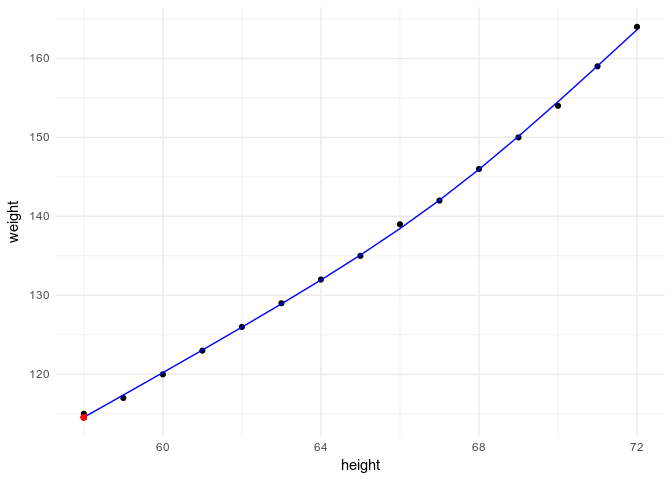
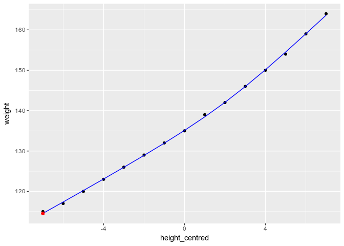
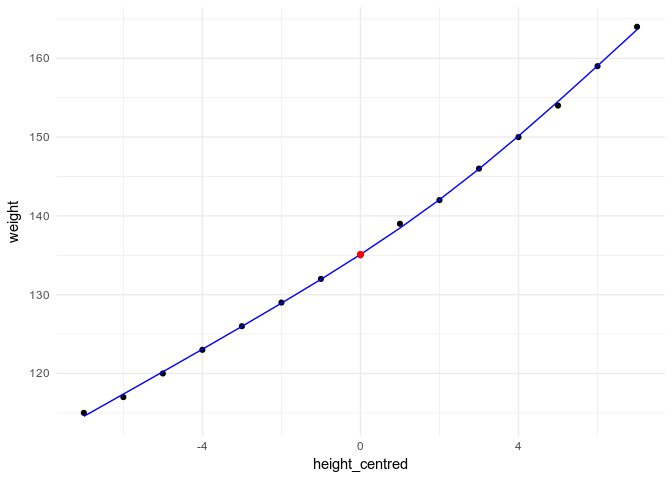
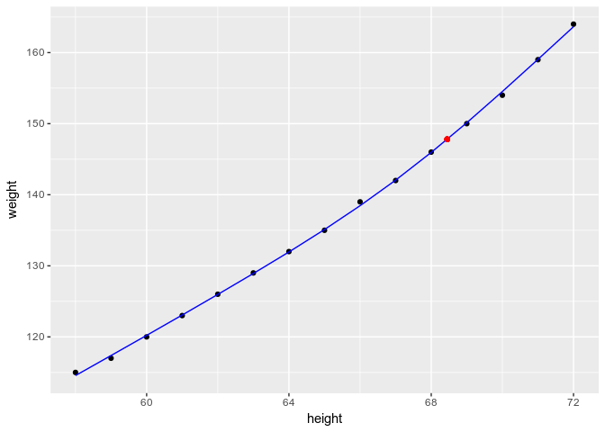

<!-- README.md is generated from README.Rmd. Please edit that file -->
splintr
=======

Natural cubic splines with interpretable intercepts: 'centres' a basis generated using `splines::ns()` on a specified x-value. When used in a model formula, this allows the model intercept to be interpreted with respect to that central x-value, rather than with respect to the x-value of the first `splines::ns()` knot.

Installation
------------

You can install splintr from github with:

``` r
# install.packages("devtools")
devtools::install_github("simisc/splintr")
```

Example
-------

``` r
library(broom)   # tidy(), augment()
library(knitr)   # kable()
library(splines) # ns()
library(splintr) # splintr()
library(ggplot2) # ggplot()
theme_set(theme_minimal())
```

Using `splines::ns()` in a model formula as below, the model intercept represents the estimated value of `weight` at the first boundary knot, i.e. when `height` takes its minimum value of 58.

``` r
kable(tidy(fm0 <- lm(weight ~ ns(height, df = 3), data = women), quick = TRUE))
```

| term                |   estimate|
|:--------------------|----------:|
| (Intercept)         |  114.55946|
| ns(height, df = 3)1 |   23.87318|
| ns(height, df = 3)2 |   53.04162|
| ns(height, df = 3)3 |   41.66370|

``` r
attr(ns(women$height, df = 3), "Boundary.knots")
#> [1] 58 72
predict(fm0, newdata = data.frame(height = 0))
#>         1 
#> -49.06522
predict(fm0, newdata = data.frame(height = 58))
#>        1 
#> 114.5595
ggplot(augment(fm0, data = women), aes(x = height)) +
  geom_point(aes(y = weight)) +
  geom_line(aes(y = .fitted), col = "blue") +
  geom_point(data = NULL, aes(x = 58, y = coef(fm0)[1]), col = "red")
```



Centring the predictor does not change the model intercept.

``` r
women$height_centred <- women$height - mean(women$height)
kable(tidy(fm1 <- lm(weight ~ ns(height_centred, df = 3), data = women), quick = TRUE))
```

| term                         |   estimate|
|:-----------------------------|----------:|
| (Intercept)                  |  114.55946|
| ns(height\_centred, df = 3)1 |   23.87318|
| ns(height\_centred, df = 3)2 |   53.04162|
| ns(height\_centred, df = 3)3 |   41.66370|

``` r
attr(ns(women$height_centred, df = 3), "Boundary.knots")
#> [1] -7  7
predict(fm1, newdata = data.frame(height_centred = 0))
#>        1 
#> 135.1067
predict(fm1, newdata = data.frame(height_centred = -7))
#>        1 
#> 114.5595
ggplot(augment(fm1, data = women), aes(x = height_centred)) +
  geom_point(aes(y = weight)) +
  geom_line(aes(y = .fitted), col = "blue") +
  geom_point(data = NULL, aes(x = -7, y = coef(fm1)[1]), col = "red")
```



Using `splintr()` instead, the intercept representes the estimated value of `weight` when the predictor `height_centred` takes a value of zero.

``` r
kable(tidy(fm2 <- lm(weight ~ splintr(height_centred, df = 3), data = women), quick = TRUE))
```

| term                              |   estimate|
|:----------------------------------|----------:|
| (Intercept)                       |  135.10672|
| splintr(height\_centred, df = 3)1 |   23.87318|
| splintr(height\_centred, df = 3)2 |   53.04162|
| splintr(height\_centred, df = 3)3 |   41.66370|

``` r
attr(splintr(women$height_centred, df = 3), "Boundary.knots")
#> [1] -7  7
predict(fm2, newdata = data.frame(height_centred = 0))
#>        1 
#> 135.1067
predict(fm2, newdata = data.frame(height_centred = -7))
#>        1 
#> 114.5595
ggplot(augment(fm2, data = women), aes(x = height_centred)) +
  geom_point(aes(y = weight)) +
  geom_line(aes(y = .fitted), col = "blue") +
  geom_point(data = NULL, aes(x = 0, y = coef(fm2)[1]), col = "red")
```



Alternatively, an arbitrary "centre" can be specified directly in the `splintr()` call.

``` r
x_centre = 68.45
kable(tidy(fm3 <- lm(weight ~ splintr(height, df = 3, centre = x_centre), data = women), quick = TRUE))
```

| term                                         |   estimate|
|:---------------------------------------------|----------:|
| (Intercept)                                  |  147.80566|
| splintr(height, df = 3, centre = x\_centre)1 |   23.87318|
| splintr(height, df = 3, centre = x\_centre)2 |   53.04162|
| splintr(height, df = 3, centre = x\_centre)3 |   41.66370|

``` r
attr(splintr(women$height, df = 3, centre = x_centre), "Boundary.knots")
#> [1] 58 72
predict(fm3, newdata = data.frame(height = x_centre))
#>        1 
#> 147.8057
ggplot(augment(fm2, data = women), aes(x = height)) +
  geom_point(aes(y = weight)) +
  geom_line(aes(y = .fitted), col = "blue") +
  geom_point(data = NULL, aes(x = x_centre, y = coef(fm3)[1]), col = "red")
```



The four models fit identically:

``` r
kable(t(rbind(
  fm0 = glance(fm0),
  fm1 = glance(fm1),
  fm2 = glance(fm2),
  fm3 = glance(fm3)
)))
```

|               |            fm0|            fm1|            fm2|            fm3|
|---------------|--------------:|--------------:|--------------:|--------------:|
| r.squared     |      0.9996629|      0.9996629|      0.9996629|      0.9996629|
| adj.r.squared |      0.9995710|      0.9995710|      0.9995710|      0.9995710|
| sigma         |      0.3210180|      0.3210180|      0.3210180|      0.3210180|
| statistic     |  10874.0608930|  10874.0608930|  10874.0608930|  10874.0608930|
| p.value       |      0.0000000|      0.0000000|      0.0000000|      0.0000000|
| df            |      4.0000000|      4.0000000|      4.0000000|      4.0000000|
| logLik        |     -1.9140458|     -1.9140458|     -1.9140458|     -1.9140458|
| AIC           |     13.8280915|     13.8280915|     13.8280915|     13.8280915|
| BIC           |     17.3683425|     17.3683425|     17.3683425|     17.3683425|
| deviance      |      1.1335783|      1.1335783|      1.1335783|      1.1335783|
| df.residual   |     11.0000000|     11.0000000|     11.0000000|     11.0000000|
